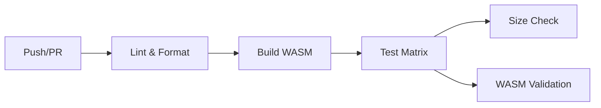

# AssemblyScript Template

> A modern AssemblyScript project template with CI/CD, testing, and publishing workflows.

Read this in other languages: [English](https://github.com/wsafight/assemblyscript-template/blob/main/README.EN.md) | [简体中文](https://github.com/wsafight/assemblyscript-template/blob/main/README.md)

[](https://github.com/wsafight/assemblyscript-template/actions/workflows/ci.yml)
[](https://www.npmjs.com/package/assemblyscript-template)
[](https://codecov.io/gh/wsafight/assemblyscript-template)

## Features

- **Modern Tooling**: Built with AssemblyScript 0.27+, Node.js 18+
- **Testing**: Native Node.js test runner with coverage
- **CI/CD**: GitHub Actions for lint, build, test, and release
- **Code Quality**: ESLint + Prettier preconfigured
- **WASM Optimization**: Multiple build targets (debug/release)
- **Publishing**: Automated npm releases with provenance

## Quick Start

```bash
# Clone the template
git clone https://github.com/wsafight/assemblyscript-template.git
cd assemblyscript-template

# Install dependencies
bun install

# Build WebAssembly
bun run asbuild

# Run tests
bun test
```

## Available Scripts

| Command                   | Description                       |
| ------------------------- | --------------------------------- |
| `bun run asbuild`         | Build debug and release WASM      |
| `bun run asbuild:debug`   | Build debug WASM with source maps |
| `bun run asbuild:release` | Build optimized release WASM      |
| `bun run asbuild:watch`   | Watch mode for development        |
| `bun test`                | Run all tests                     |
| `bun run test:coverage`   | Run tests with coverage report    |
| `bun run lint`            | Run ESLint                        |
| `bun run format`          | Format code with Prettier         |
| `bun run clean`           | Remove build artifacts            |

## Usage

### Basic Example

```js
import wasm from 'assemblyscript-template/wasm';

const { greet, add, factorial } = await wasm();

console.log(greet()); // "Hello, World!"
console.log(add(2, 3)); // 5
console.log(factorial(5)); // 120
```

### Advanced Example

```js
import wasm from 'assemblyscript-template/wasm';

const {
  greetName, // Personalized greeting
  reverseString, // String reversal
  fibonacci, // Fibonacci sequence
  sumArray, // Array operations
  increment, // Counter state
  getCounter,
  resetCounter,
} = await wasm();

console.log(greetName('Alice')); // "Hello, Alice!"
console.log(reverseString('hello')); // "olleh"
console.log(fibonacci(10)); // 55
console.log(sumArray([1, 2, 3, 4, 5])); // 15

// Counter with internal state
console.log(increment()); // 1
console.log(increment()); // 2
console.log(getCounter()); // 2
resetCounter(); // 0
```

## API Reference

### String Functions

| Function                       | Description             |
| ------------------------------ | ----------------------- |
| `greet()`                      | Returns "Hello, World!" |
| `greetName(name: string)`      | Personalized greeting   |
| `reverseString(str: string)`   | Reverses a string       |
| `countCharacters(str: string)` | Returns string length   |

### Math Functions

| Function                        | Description                   |
| ------------------------------- | ----------------------------- |
| `add(a: i32, b: i32): i32`      | Addition                      |
| `subtract(a: i32, b: i32): i32` | Subtraction                   |
| `multiply(a: i32, b: i32): i32` | Multiplication                |
| `divide(a: i32, b: i32): i32`   | Division (returns 0 on div/0) |
| `factorial(n: i32): i32`        | Factorial calculation         |
| `fibonacci(n: i32): i32`        | Fibonacci sequence            |
| `isEven(n: i32): bool`          | Check if number is even       |

### Array Functions

| Function                             | Description            |
| ------------------------------------ | ---------------------- |
| `sumArray(numbers: Array<i32>): i32` | Sum of array elements  |
| `maxArray(numbers: Array<i32>): i32` | Maximum value in array |
| `minArray(numbers: Array<i32>): i32` | Minimum value in array |

### Counter Functions

| Function              | Description                  |
| --------------------- | ---------------------------- |
| `increment(): i32`    | Increment and return counter |
| `getCounter(): i32`   | Get current counter value    |
| `resetCounter(): i32` | Reset counter to 0           |

## Project Structure

```
assemblyscript-template/
├── .github/
│   └── workflows/
│       ├── ci.yml          # CI pipeline (lint, build, test)
│       └── release.yml     # Release automation
├── assembly/
│   └── index.ts            # AssemblyScript source code
├── tests/
│   └── run-wasm.test.js    # WebAssembly tests
├── build/                  # Generated WASM files (gitignored)
├── asconfig.json           # AssemblyScript configuration
├── package.json
├── eslint.config.js        # ESLint configuration
├── .prettierrc             # Prettier configuration
└── README.md
```

## CI/CD Pipeline

The project includes a comprehensive GitHub Actions workflow:

### CI Pipeline



**Features:**

- Multi-OS testing (Ubuntu, Windows, macOS)
- Multi-version Node.js testing (18, 20, 22)
- WASM size monitoring
- Code coverage reporting to Codecov
- Automated PR comments with bundle size

### Release Pipeline

Triggered by version tags (e.g., `v1.0.0`):

1. Runs full test suite
2. Creates GitHub release with artifacts
3. Publishes to npm with provenance
4. Generates release notes

## Development

### Adding New Functions

1. Edit `assembly/index.ts`:

```typescript
export function myFunction(n: i32): i32 {
  return n * 2;
}
```

2. Rebuild:

```bash
bun run asbuild
```

3. Add tests in `tests/run-wasm.test.js`

### Build Targets

| Target  | Optimize | Shrink  | Source Map | Use         |
| ------- | -------- | ------- | ---------- | ----------- |
| Debug   | No       | No      | Yes        | Development |
| Release | Level 3  | Level 1 | Yes        | Production  |

## Publishing

```bash
# Bump version in package.json
bun version patch  # or minor, major

# Push tag to trigger release
git push --tags
```

The release workflow will:

1. Build and test the package
2. Create a GitHub release
3. Publish to npm with provenance

## License

MIT

## Resources

- [AssemblyScript Documentation](https://www.assemblyscript.org/)
- [WebAssembly MDN](https://developer.mozilla.org/en-US/docs/WebAssembly)
- [Node.js Test Runner](https://nodejs.org/api/test.html)
