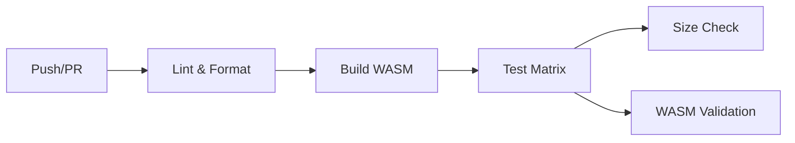

# AssemblyScript 模板

> 一个现代化的 AssemblyScript 项目模板，包含 CI/CD、测试和发布工作流。

Read this in other languages: [English](https://github.com/wsafight/assemblyscript-template/blob/main/README.EN.md) | [简体中文](https://github.com/wsafight/assemblyscript-template/blob/main/README.md)

[](https://github.com/wsafight/assemblyscript-template/actions/workflows/ci.yml)
[](https://www.npmjs.com/package/assemblyscript-template)
[](https://codecov.io/gh/wsafight/assemblyscript-template)

## 特性

- **现代化工具链**: 基于 AssemblyScript 0.27+、Node.js 18+ 构建
- **测试**: 原生 Node.js 测试运行器，支持代码覆盖率
- **CI/CD**: GitHub Actions 用于代码检查、构建、测试和发布
- **代码质量**: 预配置 ESLint + Prettier
- **WASM 优化**: 多种构建目标（调试/发布）
- **自动发布**: 自动化 npm 发布，包含来源证明

## 快速开始

```bash
# 克隆模板
git clone https://github.com/wsafight/assemblyscript-template.git
cd assemblyscript-template

# 安装依赖
bun install

# 构建 WebAssembly
bun run asbuild

# 运行测试
bun test
```

## 可用脚本

| 命令                      | 说明                      |
| ------------------------- | ------------------------- |
| `bun run asbuild`         | 构建调试和发布版 WASM     |
| `bun run asbuild:debug`   | 构建带 source map 的 WASM |
| `bun run asbuild:release` | 构建优化后的发布版 WASM   |
| `bun run asbuild:watch`   | 监听模式（开发用）        |
| `bun test`                | 运行所有测试              |
| `bun run test:coverage`   | 运行测试并生成覆盖率报告  |
| `bun run lint`            | 运行 ESLint               |
| `bun run format`          | 使用 Prettier 格式化代码  |
| `bun run clean`           | 清除构建产物              |

## 使用方法

### 基础示例

```js
import wasm from 'assemblyscript-template/wasm';

const { greet, add, factorial } = await wasm();

console.log(greet()); // "Hello, World!"
console.log(add(2, 3)); // 5
console.log(factorial(5)); // 120
```

### 高级示例

```js
import wasm from 'assemblyscript-template/wasm';

const {
  greetName, // 个性化问候
  reverseString, // 字符串反转
  fibonacci, // 斐波那契数列
  sumArray, // 数组操作
  increment, // 计数器状态
  getCounter,
  resetCounter,
} = await wasm();

console.log(greetName('Alice')); // "Hello, Alice!"
console.log(reverseString('hello')); // "olleh"
console.log(fibonacci(10)); // 55
console.log(sumArray([1, 2, 3, 4, 5])); // 15

// 带内部状态的计数器
console.log(increment()); // 1
console.log(increment()); // 2
console.log(getCounter()); // 2
resetCounter(); // 0
```

## API 参考

### 字符串函数

| 函数                           | 说明                 |
| ------------------------------ | -------------------- |
| `greet()`                      | 返回 "Hello, World!" |
| `greetName(name: string)`      | 个性化问候           |
| `reverseString(str: string)`   | 反转字符串           |
| `countCharacters(str: string)` | 返回字符串长度       |

### 数学函数

| 函数                            | 说明               |
| ------------------------------- | ------------------ |
| `add(a: i32, b: i32): i32`      | 加法               |
| `subtract(a: i32, b: i32): i32` | 减法               |
| `multiply(a: i32, b: i32): i32` | 乘法               |
| `divide(a: i32, b: i32): i32`   | 除法（除零返回 0） |
| `factorial(n: i32): i32`        | 阶乘计算           |
| `fibonacci(n: i32): i32`        | 斐波那契数列       |
| `isEven(n: i32): bool`          | 检查是否为偶数     |

### 数组函数

| 函数                                 | 说明         |
| ------------------------------------ | ------------ |
| `sumArray(numbers: Array<i32>): i32` | 数组元素求和 |
| `maxArray(numbers: Array<i32>): i32` | 数组最大值   |
| `minArray(numbers: Array<i32>): i32` | 数组最小值   |

### 计数器函数

| 函数                  | 说明             |
| --------------------- | ---------------- |
| `increment(): i32`    | 递增并返回计数器 |
| `getCounter(): i32`   | 获取当前计数器值 |
| `resetCounter(): i32` | 重置计数器为 0   |

## 项目结构

```
assemblyscript-template/
├── .github/
│   └── workflows/
│       ├── ci.yml          # CI 流水线（检查、构建、测试）
│       └── release.yml     # 发布自动化
├── assembly/
│   └── index.ts            # AssemblyScript 源代码
├── tests/
│   └── run-wasm.test.js    # WebAssembly 测试
├── build/                  # 生成的 WASM 文件（已忽略）
├── asconfig.json           # AssemblyScript 配置
├── package.json
├── eslint.config.js        # ESLint 配置
├── .prettierrc             # Prettier 配置
└── README.md
```

## CI/CD 流水线

项目包含完整的 GitHub Actions 工作流：

### CI 流水线



**功能:**

- 多操作系统测试（Ubuntu、Windows、macOS）
- 多版本 Node.js 测试（18、20、22）
- WASM 大小监控
- 代码覆盖率报告到 Codecov
- 自动 PR 评论显示包大小

### 发布流水线

由版本标签触发（如 `v1.0.0`）：

1. 运行完整测试套件
2. 创建包含产物的 GitHub 发布
3. 发布到 npm 并附带来源证明
4. 生成发布说明

## 开发

### 添加新函数

1. 编辑 `assembly/index.ts`:

```typescript
export function myFunction(n: i32): i32 {
  return n * 2;
}
```

2. 重新构建:

```bash
bun run asbuild
```

3. 在 `tests/run-wasm.test.js` 中添加测试

### 构建目标

| 目标    | 优化    | 压缩    | Source Map | 用途     |
| ------- | ------- | ------- | ---------- | -------- |
| Debug   | 否      | 否      | 是         | 开发调试 |
| Release | Level 3 | Level 1 | 是         | 生产环境 |

## 发布

```bash
# 在 package.json 中更新版本号
bun version patch  # 或 minor, major

# 推送标签触发发布
git push --tags
```

发布工作流将会：

1. 构建和测试包
2. 创建 GitHub 发布
3. 发布到 npm 并附带来源证明

## 许可证

MIT

## 相关资源

- [AssemblyScript 文档](https://www.assemblyscript.org/)
- [WebAssembly MDN](https://developer.mozilla.org/zh-CN/docs/WebAssembly)
- [Node.js 测试运行器](https://nodejs.org/api/test.html)
